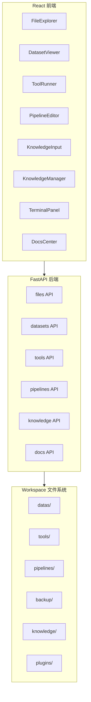

# AI 数据工作台（Workspace）项目文档（人读版）

本项目目标：本地运行的 AI 数据工作台，用于管理数据集、可视化 JSONL、执行 Python 工具脚本、构建可确认的 Pipeline、记录个人知识，并预留插件扩展能力。

> 本文面向人类阅读：强调架构与扩展点、关键数据流、使用与改造建议。

## 1. 总体架构



### 1.1 Workspace 目录约定

默认 workspace 在项目内：`workspace_project/`，也可以通过环境变量指定：

```bash
export WORKSPACE_ROOT="/abs/path/to/workspace"
```

Workspace 中的关键目录：
- `datas/`：数据集（JSONL 为主，支持子目录）
- `tools/`：Python 脚本工具（自动扫描）
- `pipelines/`：pipeline 定义（JSON）
- `backup/`：备份（只增不减，hash 去重）
- `knowledge/`：知识库（jsonl）
- `plugins/`：插件预留目录（MVP 不实现插件系统）

## 2. 关键模块设计（可扩展点）

### 2.1 Tool 执行框架

- 后端扫描 `tools/*.py` 生成 tool 列表
- 统一执行接口：通过 `python3 tools/<tool>.py <args...>` 执行
- 前端 `ToolRunner` 提供 UI 入口，输出写入 `TerminalPanel`

### 2.2 Pipeline 引擎（基础版 + 参数宏）

Pipeline 定义存储在 workspace 的 `pipelines/*.json`：

```json
{
  "name": "my_pipeline",
  "params": { "input": "datas/raw/train.jsonl", "n": "100" },
  "steps": [
    { "tool_id": "echo_sample", "args": ["--in", "{{input}}", "--n", "${n}"] }
  ]
}
```

执行规则：
- 逐步执行，每步执行后进入“待确认”
- 用户确认后才允许执行下一步

参数宏：
- 支持 `{{key}}` 和 `${key}` 两种写法
- 执行时使用 `params` + UI overrides 合并后进行替换

### 2.3 知识库（可整理）

存储：`knowledge/entries.jsonl`（每行一个 JSON）

条目字段（核心）：
- `id`、`timestamp(UTC)`、`day(本地日期)`、`text`
- `tags: []`
- `archived: bool`、`archived_at`

能力：
- 快速记录：右下角输入框支持填写 tags
- 管理页：筛选（日期/标签/搜索/含归档）、编辑、归档/取消归档
- 归档：支持“一键归档今天”和“按日期归档”

## 3. API 接口概览

更完整的接口以 Swagger 为准：`/docs`，以及 OpenAPI：`/openapi.json`。

### 3.1 文件与备份
- `GET /api/files/tree`
- `GET /api/files/children?path=...`
- `GET /api/files/read?path=...`
- `POST /api/backup/datas`

### 3.2 数据集（JSONL）
- `GET /api/datasets/list?path=...`
- `GET /api/datasets/records?path=...&file=...&offset=...&limit=...`
- `GET /api/datasets/record?path=...&file=...&index=...`

### 3.3 工具
- `GET /api/tools/list`
- `POST /api/tools/run`

### 3.4 Pipeline
- `GET /api/pipelines/list`
- `GET /api/pipelines/{id}`
- `POST /api/pipelines`
- `PATCH /api/pipelines/{id}`（更新 params/steps/name）
- `POST /api/pipelines/{id}/execute/step`（可带 params_override）
- `POST /api/pipelines/{id}/confirm`
- `POST /api/pipelines/{id}/reset`

### 3.5 Knowledge
- `GET /api/knowledge`（支持 day/tag/q/include_archived）
- `GET /api/knowledge/days`
- `POST /api/knowledge`
- `PATCH /api/knowledge/{entry_id}`
- `POST /api/knowledge/archive`

### 3.6 文档
- `GET /api/docs/human`
- `GET /api/docs/ai`

## 4. 前端交互与模块化入口

目前包含：
- 左侧文件树（可折叠）
- 顶部：导航/终端开关 +（后续会加）模块入口
- 底部终端（可折叠）
- 主体路由：数据阅读、工具、pipeline、知识库、文档

建议的扩展方向：
- 增加 `features/Plugins`，并在后端实现 `plugin_loader`/`plugin_registry` 后由插件向前端“声明模块”
- 未来把“模块列表”抽象成可注册结构（本期会做基础版）

